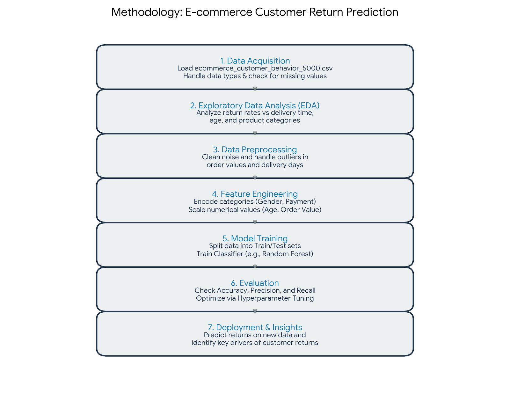

## Problem Type: 

Classification (specifically binary classification).

## Target Variable: 
returned (Values: "Yes" or "No").

## Learning Goal:
The model is expected to learn how customer attributes (age, gender), transaction details (value, category), and logistics (delivery time) influence the likelihood of a product being returned.

## diagram:

